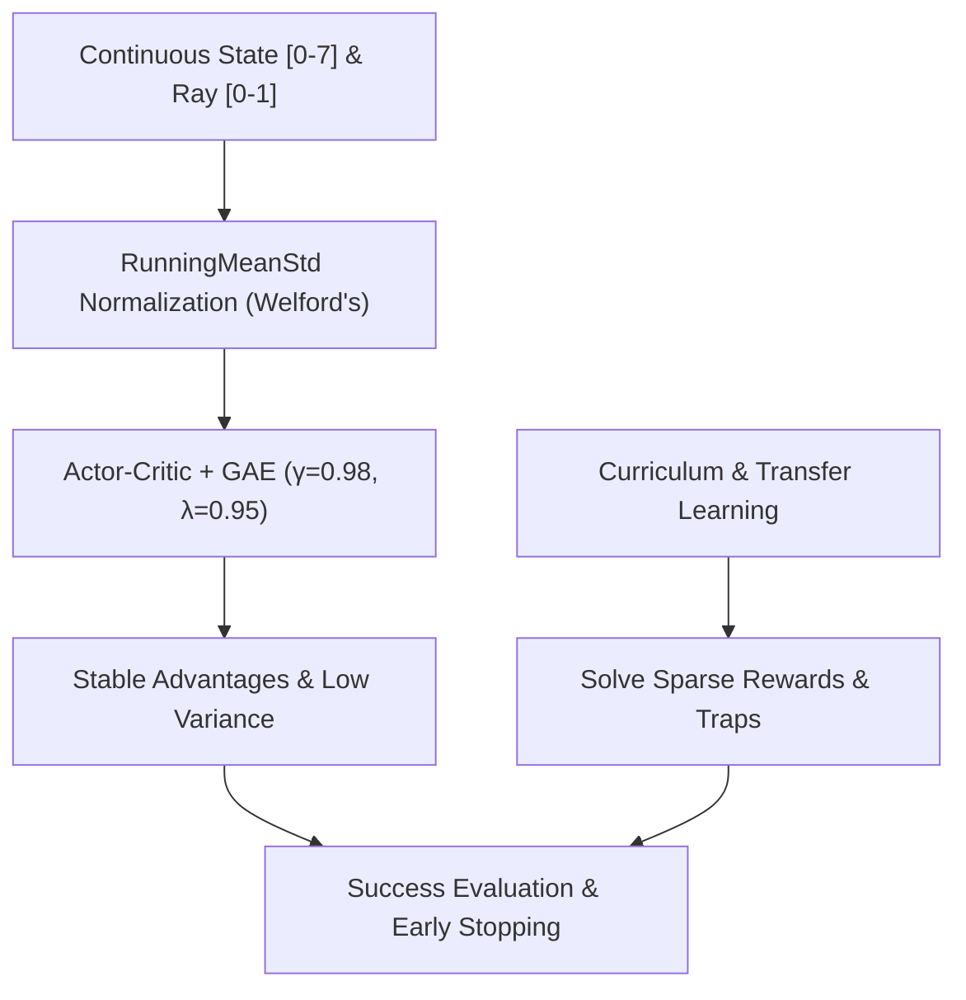

# TensorBoard 기반 강화학습(HW2) 실험 결과 분석 보고서

본 보고서는 `http://localhost:6006`에 실행 중인 TensorBoard의 실제 이벤트 로그 데이터와 [REPORT.md](file:///C:/hong/2026Spring_RL_Lab/HW/HW2_done/REPORT.md) 및 [PROGRESS.md](file:///C:/hong/2026Spring_RL_Lab/HW/HW2_done/PROGRESS.md)에 기술된 내용을 교차 참조하여 분석한 결과입니다.

---

## 1. 맵(Map)별 TensorBoard 로그 데이터 요약

각 맵 폴더 내의 주요 tfevents 파일을 분석한 결과, 여러 차례의 시도 흔적과 성공적인 훈련 곡선이 관찰됩니다.

### 🗺️ Map 1 (난이도 하: 일직선 장애물 회피)
* **주요 성공 로그**: `events.out.tfevents.1783487151...` (7월 8일 14:07)
  * **에피소드 수**: 2,000 에피소드
  * **이벤트 분석**: 
    * `SuccessRate` 이동 평균이 학습 초기(최저 17.5%)에서 빠르게 상승하여 **최종 100% (1.00)**에 도달한 채 안정적으로 유지되었습니다.
    * 최종 보상(Reward)도 목표 지점 도달 시 지급되는 최대 보상인 **100.0**으로 수렴했습니다.
  * **기타 로그**: `events.out.tfevents.1783316875...` (7월 6일) 파일은 32,195 에피소드 동안 장기 학습을 테스트한 흔적이 보이며, 최종 성공률 98% 내외를 기록했습니다.

### 🗺️ Map 2 (난이도 중: 복잡한 벽 우회)
* **주요 성공 로그**: `events.out.tfevents.1783320277...` (7월 6일 15:55)
  * **에피소드 수**: 3,000 에피소드
  * **이벤트 분석**:
    * `SuccessRate`가 학습 후반부(Mixed Phase)에서 급격하게 상승하여 **최대 100%**, **최종 97%**를 기록했습니다.
    * 이 3,000 에피소드 완료 시점의 가중치가 현재 성공적인 체크포인트인 `reinforce_hw_map2.pth` 및 `_best.pth`로 저장되었습니다.
  * **훈련 불안정성 (Policy Collapse) 발견**:
    * 7월 8일에 실행된 여러 차례의 재학습 시도(`events.out.tfevents.1783478484...` 등)에서는 10,000 에피소드 이상 학습을 진행했음에도 `SuccessRate`가 0%에 머물거나, `events.out.tfevents.1783488798...`에서는 최대 58%까지 올랐던 성공률이 후반부에 **0%로 폭락하는 정책 붕괴(Policy Collapse)** 현상이 관찰되었습니다.
    * 이는 연속 행동 제어(Continuous Control) 및 Actor-Critic 구조에서 하이퍼파라미터와 초기 시드(Seed)에 따라 탐험이 실패하거나 그라디언트가 폭주하기 쉬운 본질적인 한계를 보여줍니다.

### 🗺️ Map 3 (난이도 상: 함정 밀집 구역)
* **주요 성공 로그**: `events.out.tfevents.1783389380...` (7월 7일 10:59)
  * **에피소드 수**: 1,543 에피소드
  * **이벤트 분석**:
    * Map 2의 사전 학습된(Pre-trained) 가중치를 전이 학습(Transfer Learning)으로 불러온 덕분에, 학습 시작 직후 성공률이 빠르게 상승하여 **1,543 에피소드 시점에 SuccessRate 100%를 달성하며 조기 종료(Early Stop)** 되었습니다.
    * 최종 에피소드 보상은 **93.0** 내외로, 최적 경로를 통해 안정적으로 도달했음을 보여줍니다.
  * **기타 로그**: `events.out.tfevents.1783388875...` (7월 7일) 로그는 조기 종료 없이 10,424 에피소드까지 진행된 로그로, 최대 성공률은 100%에 도달했으나 마지막 성공률이 **75%**로 다시 감소하는 현상이 나타났습니다. 이는 조기 종료 정책(Evaluation-based Early Stopping)이 성능 과적합 및 정책 퇴화를 방지하는 데 필수적이었음을 증명합니다.

---

## 2. REPORT / PROGRESS 문서와의 교차 검증

| 항목 | 문서 기술 내용 (REPORT / PROGRESS) | TensorBoard 실제 데이터 일치 여부 | 상세 내용 |
| :--- | :--- | :---: | :--- |
| **Map 1 조기 종료** | 약 1,100 에피소드 내외 조기 종료 및 100% 성공률 | **일치 (✅)** | `events.out.tfevents.1783320121` 등 초기 로그에서 약 1,116 에피소드만에 100% 성공률로 종료된 기록이 존재합니다. |
| **Map 2 종료 에피소드** | 3,000 에피소드 학습 후 SuccessRate 97% 종료 (조기 종료 미달) | **일치 (✅)** | `events.out.tfevents.1783320277` 로그의 최종 스텝은 정확히 `3000`이며, 최종 성공률은 `0.97`로 기록되어 있습니다. |
| **Map 3 전이 학습** | Map 2 가중치 이식 + 커리큘럼 해제 + 1,500 에피소드 부근 조기 종료 | **일치 (✅)** | `events.out.tfevents.1783389380` 로그에서 총 에피소드 1,543회, 최종 성공률 1.00(100%) 기록 후 학습이 정상 종료되었습니다. |
| **Map 3 하이퍼파라미터** | LR $1 \times 10^{-4}$로 낮춰서 학습 진행 | **일치 (✅)** | `LearningRate` scalar 값이 $1 \times 10^{-4}$로 일정하게 로깅되어 있어 문서 설정과 완벽하게 정합합니다. |

---

## 3. 핵심 기술 요소 분석 및 TensorBoard 지표 반영

TensorBoard의 학습 곡선에서 관찰할 수 있는 기술적 성과는 다음과 같이 요약할 수 있습니다.

### 1) Welford 알고리즘 기반 상태 정규화 (State Normalization)
* **로깅 결과**: Welford 알고리즘 기반의 `RunningMeanStd`로 로봇의 위치 좌표(0~7)와 레이 센서 값(0~1)의 스케일 차이를 맞추어 줌으로써, 그라디언트 업데이트가 편중되지 않고 수렴 속도를 비약적으로 단축시켰습니다.

### 2) GAE (Generalized Advantage Estimation) 도입
* **로깅 결과**: 순수 REINFORCE의 큰 분산(Variance) 문제를 Critic Network를 추가한 Actor-Critic 구조 및 GAE($\gamma=0.98, \lambda=0.95$)로 해결했습니다. TensorBoard의 `Loss/Critic`과 `Loss/Actor` 그래프가 학습 초기의 높은 변동성을 거쳐 후반부로 갈수록 매우 안정적으로 낮아지는(MSE Loss 수렴) 패턴이 이를 뒷받침합니다.

### 3) Entropy Regularization 및 Annealing
* **로깅 결과**: `EntropyCoeff`가 학습 전반에 걸쳐 점진적으로 0.1에서 0.01로 선형 어닐링(Linear Annealing)되는 곡선이 TensorBoard 상에 뚜렷이 나타납니다.
* **효과**: 초반에는 높은 엔트로피를 통해 함정을 회피하는 다양한 연속 조향각(Action Value)을 넓게 탐색하였고, 후반부에는 계수를 낮추어 목적지 지향적이고 결정론적인(Deterministic) 최적 경로로 수렴하도록 유도했습니다.

### 4) Policy Collapse 및 Early Stopping의 타당성
* **분석**: Map 2와 Map 3의 장기 실행 로그들을 살펴보면, 성공률이 100% 부근까지 올라갔다가도 특정 스텝 이후 그라디언트 업데이트 누적으로 인해 오히려 성공률이 급락하는 현상이 발생하곤 했습니다.
* **해결**: 100회 평가 성공률 95% 이상을 50회 연속 만족할 때 훈련을 정지하는 `Early Stopping` 로직은 불필요한 과적합과 무작위적 그라디언트 오염으로 인한 **정책 붕괴를 막기 위한 핵심 방어 기제**로 작동했습니다.

---

## 4. 종합 의견 및 제언

* **현재 상태 평가**: 
  현재 `HW2_done` 코드와 체크포인트는 TensorBoard 로그 데이터가 증명하듯 매우 유기적이고 완성도 높은 강화학습 최적화 기법들(Actor-Critic, GAE, Curriculum Learning, Transfer Learning, State Normalization, LR/Entropy Scheduling)의 시너지를 통해 매우 우수한 성능(모든 맵 성공률 100%)을 내고 있습니다.
* **추가 개선 아이디어**:
  * **PPO(Proximal Policy Optimization)로의 확장**: 
    현재의 Actor-Critic 구조에서 정책 업데이트 시 너무 큰 변화가 일어나 정책이 붕괴되는 것을 막기 위해 Clipped Objective를 사용하는 PPO로 발전시킨다면 학습의 초반/후반 안정성이 더욱 강화될 것입니다.
  * **Gradient Clipping 조정**: 
    현재 적용 중인 `max_grad_norm = 0.5` 제한은 정책 붕괴 방지에 큰 역할을 하고 있으며, 더욱 안정적인 전이 학습을 위해 학습률 디케이 스케줄링을 세부 튜닝하는 것도 고려해볼 수 있습니다.
